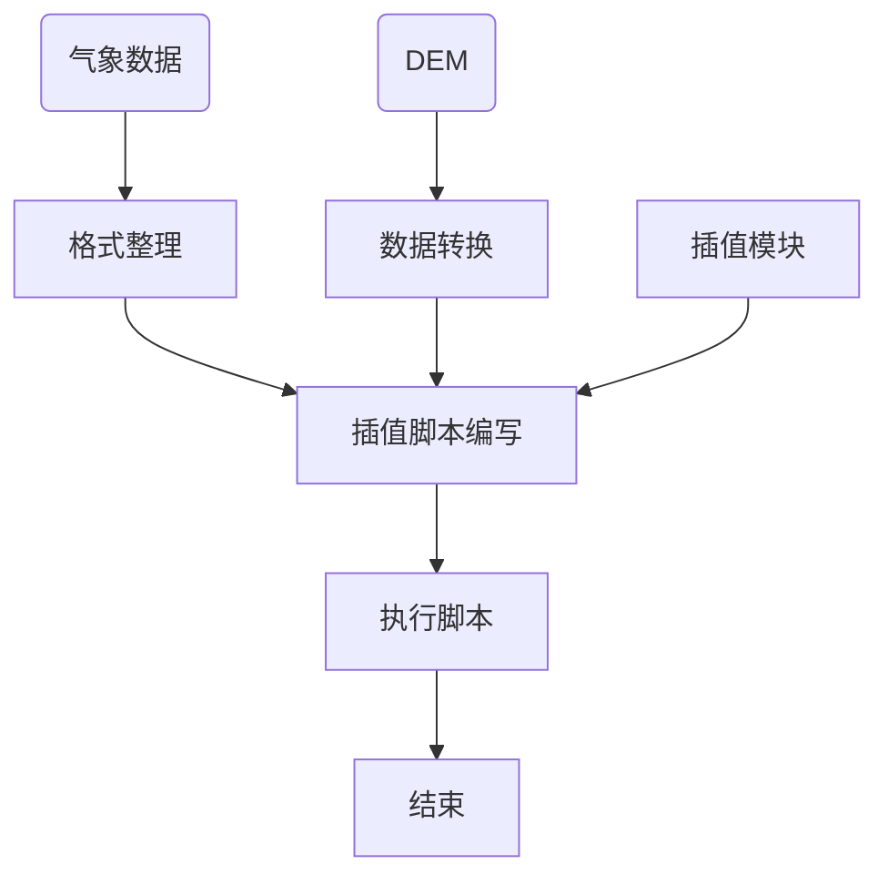

&emsp;&emsp; ANUSPLIN 插值需要对 [原始气象数据](4.DataPP.html)、[DEM 数据进行预处理](5.DEMPP.html)，然后编写插值脚本进行插值。整体插值思路如下图：

```mermaid
graph TD
	A(气象数据) -->B[格式整理]--> E[插值脚本]
	C(DEM) -->D[数据转换]--> E[插值脚本]
	F[插值模块]--> E[插值脚本编写]
	E-->G[执行脚本]-->H[结束]
```

