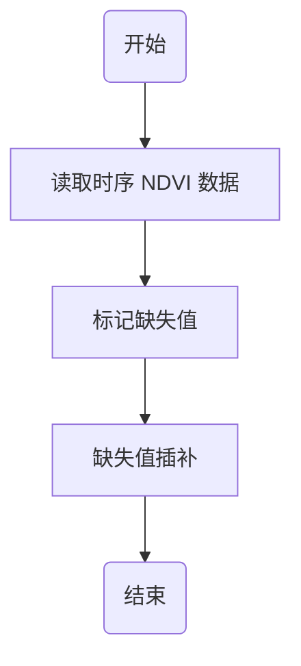

---
title: 缺失值插补
date: 2021-10-11 23:12:00
tags:
 - Python
categories:
 - 资源教程
---
&emsp;&emsp;（时间）序列数据处理过程中往往会有缺失值（例如 9999、NaN 或其他的异常值），对这些数据的处理是下一步分析、研究和应用的基础。

&emsp;&emsp;本文以 2018 年 MOD09A01 地表反射率数据计算的 8 天合成 46 期 NDVI 数据为基础（已完成去云处理，有云时段的数据已赋值为 NaN，部分数据做了微调，以符合本文的内容），选取 一个样点（样点经度：123°4′0.87″，纬度：42°56′45.75″），完成时序有云数据（缺失值）的插补。
<!-- more -->

## 0 基本思路

<center>



</center>

## 1 读取数据

&emsp;&emsp;本文的样例数据为EXECL格式，已上传至百度网盘，下载链接如下：

> **链接：https://pan.baidu.com/s/1PR4MXMIIihRyv_7GQMl9VQ**
>
> **提取码：ynyv**

**&emsp;&emsp;目标：将需要插补的原始数据读取为数组。**

```python
# 导入库
import pandas as pd
import matplotlib.pyplot as plt
import numpy as np
```

```python
# 读取原始数据
InFile = r'D:\xxxx\NDVI.xlsx'
Data = pd.read_excel(InFile)['NDVI'].values
print(Data)
```

```python
[     nan      nan 0.223985 0.233396 0.227466 0.229259      1.2 0.231399
 0.22672       nan 0.224726 0.212029 0.236226 0.229548 0.236484 0.248894
 0.266551 0.275269 0.274135 0.270156      nan 0.478553 0.590506 0.721067
      nan 0.799064 0.742108 0.804224 0.83514  0.777888 0.734315 0.700915
 0.602857 0.553114 0.397294 0.318083 0.289676 0.253421  0.25891  0.24601
 0.23812  0.238319 0.238759 0.232261 0.253731 0.236231]
```

&emsp;&emsp;简单做个图，我们看一下原始数据的样式。

```python
# 定义一个横坐标
X = np.array(range(len(Data)))

plt.plot(X, Data, color = 'r')
```


&emsp;&emsp;其中截断的部分是有缺失值的部分（即 NaN ）。下一步，我们对缺失值进行插值填充。

## 2 缺失值插补

### 2.1 标记异常值

&emsp;&emsp;由于NDVI的最大值不可能大于1，则原始数据中 第 7 个值 1.2 明显为异常值。我们将异常值统一标记为缺失值。

```python
Data[6] = np.nan
print(Data)
```

```python
[     nan      nan 0.223985 0.233396 0.227466 0.229259      nan 0.231399
  0.22672      nan 0.224726 0.212029 0.236226 0.229548 0.236484 0.248894
 0.266551 0.275269 0.274135 0.270156      nan 0.478553 0.590506 0.721067
      nan 0.799064 0.742108 0.804224 0.83514  0.777888 0.734315 0.700915
 0.602857 0.553114 0.397294 0.318083 0.289676 0.253421  0.25891  0.24601
 0.23812  0.238319 0.238759 0.232261 0.253731 0.236231]
```
&emsp;&emsp;简单做个图，我们看一下标记完异常值后的结果。
```python
plt.plot(X, Data, color = 'y')
```


### 2.2 处理首末端缺失值

&emsp;&emsp;首末端缺失值我们采用最邻近法填充（当然，也可以采用其他方法，这里不做示例）。

```python
# 标记正常数据的位置
ValidDataIndex = X[np.where(np.isnan(Data) == 0)]

# 如果最后一个正常数据的序号比序列长度小，则表明最后一个正常数据后存在缺失数据
if ValidDataIndex[-1] < len(Data) - 1: 
    Data[ValidDataIndex[-1] + 1:] = Data[ValidDataIndex[-1]]  
    
# 如果第一个正常数据的序号不是0，则表明第一个正常数据前存在缺失数据
if ValidDataIndex[0] >= 1:
    Data[:ValidDataIndex[0]] = Data[ValidDataIndex[0]] 
print(Data)
```

```python
[0.223985 0.223985 0.223985 0.233396 0.227466 0.229259      nan 0.231399
 0.22672       nan 0.224726 0.212029 0.236226 0.229548 0.236484 0.248894
 0.266551 0.275269 0.274135 0.270156      nan 0.478553 0.590506 0.721067
      nan 0.799064 0.742108 0.804224 0.83514  0.777888 0.734315 0.700915
 0.602857 0.553114 0.397294 0.318083 0.289676 0.253421 0.25891  0.24601
 0.23812  0.238319 0.238759 0.232261 0.253731 0.236231]
```
&emsp;&emsp;简单做个图，我们看一下首末端缺失值处理后的结果。

```python
plt.plot(X, Data, color = 'g')
```


### 2.3 缺失值插补

&emsp;&emsp;插值过程我们使用 scipy 库插值模块的一维插值 interp1d 方法进行拟合，然后填充缺失值。

```python
# 引入库（方法）
from scipy.interpolate import interp1d
```
&emsp;&emsp;缺失数据不参与拟合，首先把缺失数据去除，对正常数据进行拟合。
```python
# 步骤1：提取参与拟合的数据（X_0，Y_0）。由于缺失数据不能参与拟合，在拟合前，拟合数据需要先剔除异常值。
Y_0 = Data[np.where(np.isnan(Data) != 1)]
print(Y_0)
```

```python
[0.223985 0.223985 0.223985 0.233396 0.227466 0.229259 0.231399 0.22672
 0.224726 0.212029 0.236226 0.229548 0.236484 0.248894 0.266551 0.275269
 0.274135 0.270156 0.478553 0.590506 0.721067 0.799064 0.742108 0.804224
 0.83514  0.777888 0.734315 0.700915 0.602857 0.553114 0.397294 0.318083
 0.289676 0.253421 0.25891  0.24601  0.23812  0.238319 0.238759 0.232261
 0.253731 0.236231]
```

```python
X_0 = X[np.where(np.isnan(Data) != 1)]
print(X_0)
```

```python
[ 0  1  2  3  4  5  7  8 10 11 12 13 14 15 16 17 18 19 21 22 23 25 26 27
 28 29 30 31 32 33 34 35 36 37 38 39 40 41 42 43 44 45]
```
&emsp;&emsp;利用拟合函数，根据缺失数据的标签，拟合缺失位置的数据。
```python
# 步骤2：构造拟合函数，这里使用线性插值（'linear'）
IRFunction = interp1d(X_0, Y_0, kind = 'linear')

# 步骤3：提取缺失值数据的标签值
Fill_X = X[np.where(np.isnan(Data) == 1)]

# 步骤4：拟合缺失数据，并用拟合值替换缺失值
Fill_Y = IRFunction(Fill_X)
Data[Fill_X] = Fill_Y 

print(Data)
```

```python
[0.223985  0.223985  0.223985  0.233396  0.227466  0.229259  0.230363
 0.231399  0.22672   0.225723  0.224726  0.212029  0.236226  0.229548
 0.236484  0.248894  0.266551  0.275269  0.274135  0.270156  0.3743545
 0.478553  0.590506  0.721067  0.7600655 0.799064  0.742108  0.804224
 0.83514   0.777888  0.734315  0.700915  0.602857  0.553114  0.397294
 0.318083  0.289676  0.253421  0.25891   0.24601   0.23812   0.238319
 0.238759  0.232261  0.253731  0.236231 ]
```

&emsp;&emsp;简单做个图，我们看一下插值结果。

```python
plt.plot(X, Data, color = 'b')
```

## 3 利用 gma 库 FillNoData 函数插补

&emsp;&emsp;gma 已对插值函数进行封装，详细函数说明请参见 [gma.math.FillNoData](/01.gma/6.Use.html#_2-2-fillnodata)。

&emsp;&emsp;我们只需带入原始数据（Data），设置异常值（FillValue）和插值方法（Method）即可获得相应结果。

```python
import gma
Data = gma.math.FillNoData(Data, FillValue = 1.2, Method = 'linear')
print(Data)
```

&emsp;&emsp;插值结果与 **< 2 缺失值插补 >** 结果一致。
```python
[0.223985  0.223985  0.223985  0.233396  0.227466  0.229259  0.230329
 0.231399  0.22672   0.225723  0.224726  0.212029  0.236226  0.229548
 0.236484  0.248894  0.266551  0.275269  0.274135  0.270156  0.3743545
 0.478553  0.590506  0.721067  0.7600655 0.799064  0.742108  0.804224
 0.83514   0.777888  0.734315  0.700915  0.602857  0.553114  0.397294
 0.318083  0.289676  0.253421  0.25891   0.24601   0.23812   0.238319
 0.238759  0.232261  0.253731  0.236231 ]
```
&emsp;&emsp;简单做个图，我们看一下插值结果。

```python
plt.plot(X, Data, color = 'gray')
```


::: theorem 
&emsp;&emsp;本文使用了简单的 interp1d（scipy） 的插值方法（不考虑 gma ），当然，如果专门做数据处理，其实 pandas 的 interpolate 也非常好用。
:::


