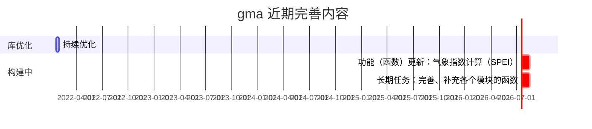

## 更新计划

## 更新测试中的新内容

&emsp;　更新测试中的新内容将在下一个 gma 版本中发布。下一版本 **1.0.5** 。

<i class="fas fa-box"></i> **增加 [smc](UserGuide-smc.html) 函数包。** 提供（或未来提供）空间杂项（例如计算空间距离、面积、坐标转换等操作）计算！

<i class="fas fa-award"></i> **新增：**

&emsp;　1、增加【[CALDistanceFromPoint](UserGuide-smc.html#caldistancefrompoint)】函数

&emsp;　　计算距离。计算输入两点（或多点）之间的距离。引用：gma.smc.CALDistanceFromPoint

<i class="fab fa-superpowers"></i> **优化：**

&emsp;　1、相关系数计算函数（r）

&emsp;　　相关系数计算函数名由 r 改为 [CORR](UserGuide-math.html#corr)，并增加 pearson（皮尔逊相关）、kendall（肯德尔秩相关），spearman（斯皮尔曼相关）三种可选的相关系数计算方法。

&emsp;　2、Select

&emsp;　　参数设置错误时将会引发异常，不在默认返回 RMSE 结果。

