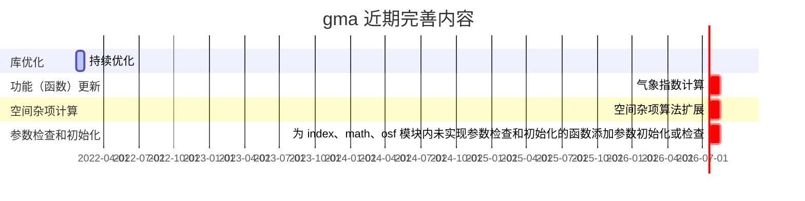

## 更新前瞻

```mermaid
gantt
        dateFormat  YYYY-MM-DD
        title gma 近期完善内容

        section 库优化

        持续优化: active, des3, 2022-01-20, 2022-02-10

        section 功能（函数）更新

        气象指数计算: crit, after now,30d
        
        section 空间杂项计算

        空间杂项算法扩展: crit, after now,30d

        section 参数检查和初始化

        为 index、math、osf 模块内未实现参数检查和初始化的函数添加参数初始化或检查: crit, after now,30d

```

## 更新测试中的新内容

&emsp;　更新测试中的新内容将在下一个 gma 版本中发布。下一版本 **1.0.6** 。
