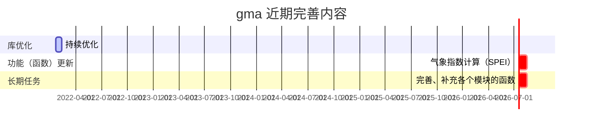

## 更新前瞻

## 更新测试中的新内容

&emsp;　更新测试中的新内容将在下一个 gma 版本中发布。下一版本 **1.0.5** 。

<i class="fas fa-box"></i> **增加 [smc](UserGuide-smc.html) 函数包。** 提供（或未来提供）空间杂项（例如计算空间距离、面积、坐标转换等操作）计算！

<i class="fas fa-award"></i> **新增：**

&emsp;　1、增加【[CALDistance](UserGuide-smc.html#caldistance)】函数

&emsp;　　计算距离。计算输入两点（或多点）之间的距离。引用：gma.smc.CALDistance

&emsp;　2、增加【[TRANCoordinate](UserGuide-smc.html#trancoordinate)】函数

&emsp;　　坐标转换。将输入点的坐标转换为目标坐标系的坐标。引用：gma.smc.TRANCoordinate

<i class="fab fa-superpowers"></i> **优化：**

&emsp;　1、相关系数计算函数（r）

&emsp;　　相关系数计算函数名由 r 改为 [CORR](UserGuide-math.html#corr)，并增加 pearson（皮尔逊相关）、kendall（肯德尔秩相关），spearman（斯皮尔曼相关）三种可选的相关系数计算方法。

&emsp;　2、Select

&emsp;　　参数设置错误时将会引发异常，不在默认返回 RMSE 结果。

&emsp;　3、GetPath

&emsp;　　a. 参数 String 修改为 Include，功能不变。

&emsp;　　b. 增加 Exclude 参数，用以排除包含此参数设置值的路径。

&emsp;　4、依赖包

&emsp;　　不在将 gdal 作为安装 gma 的前提。即使缺少 gdal，gma 仍可以正常安装，但无法引用。
