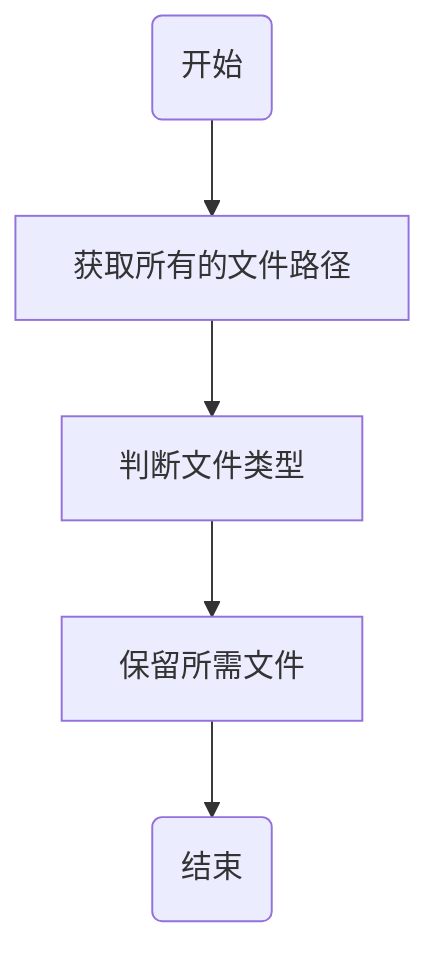

---
title: 获取路径
date: 2021-10-11 23:12:00
tags:
 - gma
 - Python
 - 数据处理
categories:
 - 资源教程
---

&emsp;&emsp;当我们批量进行文件处理时，往往需要程序自动读取某一文件夹下某一类型的所有文件。因此，本文针对查找某一类型的文件或文件夹的方法进行示例和说明。

<!-- more -->

&emsp;&emsp;本文提供两种批量查找文件的方法：

**&emsp;&emsp;1）一种采用 os 库来进行。**

**&emsp;&emsp;2）另一种采用 glob 库（推荐方法）通过通配符的方式查找**。

&emsp;&emsp;并提供相应的基础示例，由简单到复杂，方便理解。除此之外，还针对两种库**构造函数实例**，实现获取全部文件夹、文件等多种高级搜索功能，甚至还能查找含有固定字符的文件或文件夹。

&emsp;&emsp;基于 glob 的方法已经构建 [GetPath](/gma/UserGuide-osf.html#getpath)  函数并合入 gma 库，方便应用时直接调用，简化应用过程。

## 0 关键字
&emsp;&emsp;遍历，文件，os，glob，通配符

## 1 主要思路

<center>



</center>

## 2 示例数据

&emsp;&emsp;1）定义查找文件夹路径
```python
Path = r'D:\CSDN\Python系统交互\0 按指定规则查找目录下所有文件'
```

::: warning 注意

\ 为特殊字符，加上 r 后表示不进行转义，Python 才能正常识别此路径。当然，路径表述还有其他的方式，例如：

&emsp;&emsp;利用 \\\：Path = 'D:\\\CSDN\\\Python系统交互\\\0 按指定规则查找目录下所有文件'

&emsp;&emsp;利用 /：Path = 'D:/CSDN/Python系统交互/0 按指定规则查找目录下所有文件'

**这几种方式等效**。

:::

&emsp;&emsp;2）示例文件组织方式
&emsp;

&emsp;&emsp;文件夹下有 3 个 txt 文件、1 个 csv 文件和一个子文件夹 [其他]，子文件夹 [其他] 下有一个 txt 文件和一个 csv 文件。

::: theorem 示例文件组织方式

0 按指定规则查找目录下所有文件

----其他

-------201805.txt

-------201806.csv

----201801.txt

----201802.txt

----201803.txt

----201804.csv

::: 

## 3 os 方法
&emsp;&emsp;首先导入os库。
```python
import os
```
### 3.1 获取指定扩展名的文件

#### **（一）获取文件夹下（不包括子文件夹）下的文件**
&emsp;&emsp;1）获取所有文件和文件夹路径
```python
Files = os.listdir(Path)
```
&emsp;&emsp;2）获取所有 txt 文件


**&emsp;&emsp;基础**：利用for循环

```python
NeedFiles = []  # 创建一个空列表存储最终的结果
for File in Files:
	if File.endswith('.txt'):
		# 通过os.path.join将Path与文件名File组合为完整文件路径，并将结果添加到NeedFilse
		NeedFiles.append(os.path.join(Path,File))  
print(NeedFiles)
```
**&emsp;&emsp;优化**：构造列表解析式
```python
NeedFiles = [os.path.join(Path,File) for File in Files if File.endswith('.txt')]
print(NeedFiles)
```
&emsp;&emsp;打印结果：
```python
['D:\\CSDN\\Python系统交互\\0 按指定规则查找目录下所有文件\\201801.txt',
 'D:\\CSDN\\Python系统交互\\0 按指定规则查找目录下所有文件\\201802.txt',
 'D:\\CSDN\\Python系统交互\\0 按指定规则查找目录下所有文件\\201803.txt']
```
#### **（二）获取文件夹及其子文件夹下的文件**
::: theorem 
 **任务目标**：提取 **[Path]** 及其子文件夹 **[其他]** 下所有 txt 文件。

 **预期结果**：返回:

 &emsp;&emsp;D:\\CSDN\\Python系统交互\\0 按指定规则查找目录下所有文件\\201801.txt

 &emsp;&emsp;D:\\CSDN\\Python系统交互\\0 按指定规则查找目录下所有文件\\201802.txt

 &emsp;&emsp;D:\\CSDN\\Python系统交互\\0 按指定规则查找目录下所有文件\\201803.txt 

 &emsp;&emsp;D:\\CSDN\\Python系统交互\\0 按指定规则查找目录下所有文件\\其他\\201805.txt 
:::
**&emsp;&emsp;基础**：利用for循环
```python
NeedFiles = []
for Root, Folders, FileNames in os.walk(Path):
    for FileName in FileNames:
        if FileName.endswith('.txt'):
            NeedFiles.append(os.path.join(Root, FileName))
print(NeedFiles)
```
> **其中 Folders 为子文件夹集合，FileNames 为子文件集合。如果需要获取子文件夹，则将`for FileName in FileNames`部分改为`for Folder in Folders`，按照需求判断即可。**

**&emsp;&emsp;练习1**：利用 列表解析式 **优化** 本节提取过程。

**&emsp;&emsp;练习2**：获取所有**子文件夹**路径。

::: tip 提示
 &emsp;&emsp;当然，**正则表达式(regular expression)** 也可以用来检查一个串是否含有某种子串、将匹配的子串替换或者从某个串中取出符合某个条件的子串等。
:::

**&emsp;&emsp;探索**：利用 **re 库**构建**正则表达式**匹配文件。有兴趣的朋友可以尝试。

&emsp;&emsp;打印结果：
```python
['D:\\CSDN\\Python系统交互\\0 按指定规则查找目录下所有文件\\201801.txt',
 'D:\\CSDN\\Python系统交互\\0 按指定规则查找目录下所有文件\\201802.txt',
 'D:\\CSDN\\Python系统交互\\0 按指定规则查找目录下所有文件\\201803.txt',
 'D:\\CSDN\\Python系统交互\\0 按指定规则查找目录下所有文件\\其他\\201805.txt']
```

### 3.2 构造 GetPath 函数

&emsp;&emsp;此函数可实现对 1 个或多个文件夹内所需类型（SearchType）和指定扩展名（EXT）文件的查找，函数整体是对 [3.1 获取指定扩展名的文件](0.GetPath.html#_3-1-获取指定扩展名的文件) 所述内容的扩展，有兴趣的朋友可自行调用测试，也欢迎对其进行改造优化。
```python
def GetPaths(SearchPath, SearchType = 'FILE', EXT = None):
     
    def GetALLPath(SearchPath): # 获取所有文件和文件夹路径。
        PathsList = [] 
        
        if isinstance(SearchPath, list) is False: # 如果参数不是列表，则将其转为列表  
            SearchPath = list([SearchPath])
            
        for SubPath in SearchPath: # 遍历列表内所有项
        
            if os.path.isdir(SubPath): # 如果是文件夹，则按照 4.2 的思路查找所有文件和文件夹
                for Root, Folders, FileNames in os.walk(SubPath):
                    for Folder in Folders:
                        PathsList.append(os.path.join(Root, Folder))   
                    for FileName in FileNames:
                        PathsList.append(os.path.join(Root, FileName))
                        
            else: # 如果是文件，且文件存在，则直接记录文件路径
                if os.path.exists(SubPath):
                    PathsList.append(SubPath)
                    
        return list(set(PathsList))
        
    def GetSubPath(): 
        OutList = []
        for Path in PathsList: # 遍历 PathsList 列表内的所有项
        	# 如果SearchType参数（忽略大小写）为'DIR'则记录文件夹。
            if SearchType.upper() == 'DIR': 
                if os.path.isdir(Path): 
                    OutList.append(Path) 
            else:
            	# 如果未设置扩展名则保留所有文件，否则保留指定扩展名的文件。
                if os.path.isfile(Path): 
                    if EXT is None: 
                        OutList.append(Path)
                    else:
                        if Path.lower().endswith(EXT.lower()):
                            OutList.append(Path)         
        return OutList   
                        
    PathsList = GetALLPath(SearchPath)
    
    # 如果SearchType不为'DIR'或'FILE'，则返回所有文件和文件夹路径（本例结果均包含子文件和子文件夹）。
    if SearchType.upper() != 'DIR' and SearchType.upper() != 'FILE':
        return PathsList
    else:      
        return GetSubPath()
```

**&emsp;&emsp;引用：**

```python
NeedFiles = GetPath(Path, EXT = '.txt')
print(NeedFiles)
```
&emsp;&emsp;打印结果：
```python
['D:\\CSDN\\Python系统交互\\0 按指定规则查找目录下所有文件\\其他\\201805.txt',
 'D:\\CSDN\\Python系统交互\\0 按指定规则查找目录下所有文件\\201801.txt',
 'D:\\CSDN\\Python系统交互\\0 按指定规则查找目录下所有文件\\201803.txt',
 'D:\\CSDN\\Python系统交互\\0 按指定规则查找目录下所有文件\\201802.txt']
```
## 4 glob 方法（推荐）

### 4.1 常用通配符简介

通配符|简介
:----|:----
*|匹配零个或多个字符，但不匹配"."开头的文件。
?|仅匹配其中某一个单字符。
[]|匹配括号内的任意单字符，可使用“-”符号表示一个范围。例如：[0-9]：匹配数字范围；[a-z]：匹配字母范围。
**|匹配所有字符。glob进行递归操作时设置此通配符才能生效。

### 4.2 获取指定扩展名的文件
#### **（一）获取文件夹下（不包括子文件夹）下的文件**
::: theorem
**任务目标**：提取 **[Path]** 下所有 csv 文件（不包含子文件夹 **[其他]** 下的 csv 文件）。

**预期结果**：返回:

 &emsp;&emsp;D:\\CSDN\\Python系统交互\\0 按指定规则查找目录下所有文件\\201804.csv
:::

&emsp;&emsp;代码如下：
```python
import glob
Files = glob.glob(Path+'\*.csv')
print(Files)
```
&emsp;&emsp;打印结果：
```python
['D:\\CSDN\\Python系统交互\\0 按指定规则查找目录下所有文件\\201804.csv']
```
#### **（二）获取文件夹及其子文件夹下的文件**
::: theorem
**任务目标**：提取 **[Path]** 及其子文件夹 **[其他]** 下所有 csv 文件。

**预期结果**：返回:

 &emsp;&emsp;D:\\CSDN\\Python系统交互\\0 按指定规则查找目录下所有文件\\201804.csv

 &emsp;&emsp;D:\\CSDN\\Python系统交互\\0 按指定规则查找目录下所有文件\\其他\\201806.csv
:::
&emsp;&emsp;利用 glob 库**递归**的思路实现返回结果。代码如下：
```python
Files = glob.glob(Path+'\**\*.csv', recursive = True) # recursive 是否进行递归。
print(Files)
```
&emsp;&emsp;打印结果：
```python
['D:\\CSDN\\Python系统交互\\0 按指定规则查找目录下所有文件\\201804.csv',
 'D:\\CSDN\\Python系统交互\\0 按指定规则查找目录下所有文件\\其他\\201806.csv']
```

### 4.4 利用 gma 库 GetPath 函数

&emsp;&emsp;推荐使用该函数实现查找功能。该函数已经集成到 gma 库，详细的函数帮助参见 [gma.osf.GetPath](/01.gma/6.Use.html#_3-1-getpath)。

&emsp;&emsp;该函数可以以一个或多个文件夹为查找目标（Path），实现文件、文件夹、文件和文件夹查找（Search）；查找文件时可提供扩展名（EXT），获取目标类型的文件；同时，也能够根据文件包含的字符串（String），实现精确查找。当然，EXT 和 String 参数也可为列表，实现多类型，多字符串的同时匹配，满足多种查找需求。另外，如果大家有其他更好的想法，也欢迎反馈和讨论。

**&emsp;&emsp;引用：**

```python
import gma
NeedFiles = gma.osf.GetPath(Path, EXT = '.csv')
print(NeedFiles)
```
&emsp;&emsp;打印结果：
```python
['D:\\CSDN\\Python系统交互\\0 按指定规则查找目录下所有文件\\201804.csv',
 'D:\\CSDN\\Python系统交互\\0 按指定规则查找目录下所有文件\\其他\\201806.csv']
```

